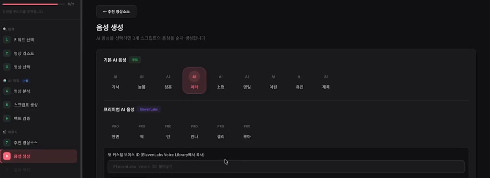
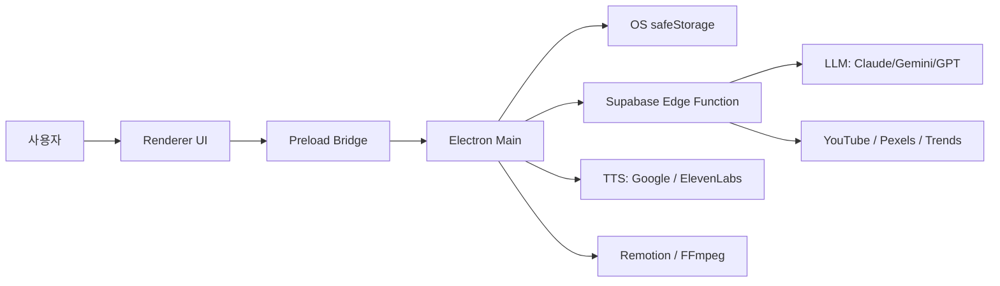

# 유튜브도사 — 멀티 AI 영상 제작 데스크톱 앱

키워드 탐색부터 영상 분석, 대본 작성, 팩트체크, AI 음성, 영상 제작 패키징까지 하나의 흐름으로 연결한 Electron 데스크톱 앱.

<sub>An AI-assisted Electron desktop app that orchestrates research, script generation, fact-checking, TTS, and video production into a single workflow.</sub>

> **프로젝트 상태**
> 제품 설계와 구현, 내부 QA, 데모 제작까지 완료한 프로젝트입니다.
> 협업을 전제로 개발했으나 계약이 최종 성사되지 않아, 실제 배포와 프로덕션 운영으로는 이어지지 않았습니다. 따라서 실사용자·운영 데이터·성과 지표는 없습니다.

## 데모

실제 앱이 동작하는 전체 흐름을 데모 영상으로 담았습니다.

[](https://www.youtube.com/watch?v=4hVRpJiMrlw)

▶ [실제 작동 데모 영상 보기](https://www.youtube.com/watch?v=4hVRpJiMrlw)

## 이 프로젝트를 만든 이유

영상 제작을 배우는 사람이 주제 탐색, 유튜브 자료 수집, 영상 분석, 대본 작성, 팩트체크, 음성 생성, 편집용 자료 정리를 매번 여러 도구를 오가며 반복해야 하는 상황을, 하나의 데스크톱 워크플로로 묶어보려 했습니다.

이 문제는 협업 논의와 기획 단계에서 정의한 것이며, 실제 사용자 인터뷰나 운영 데이터로 검증한 것은 아닙니다.

## 제품 기획과 구현에서 맡은 역할

기획자·디자이너·개발자를 따로 두지 않고 혼자 진행한 프로젝트입니다. 제가 직접 판단하고 책임진 범위는 다음과 같습니다.

- 해결할 문제와 제품 범위 정의
- 10단계 사용자 워크플로 설계
- 기능 요구사항과 우선순위 결정
- 화면 구조와 UX 흐름 설계
- 각 AI 모델과 외부 API의 역할 배분
- Electron Main / Preload / Renderer 구조와 보안 경계 설계
- Supabase 인증·관리 기능 구성
- 오류 재현, 원인 범위 축소, QA 기준 정의
- 데스크톱 패키징 구조 설계와 데모 제작

코드 작성에는 Claude Code를 비롯한 AI 코딩 에이전트를 적극적으로 활용했습니다. 저는 문제 정의와 제품 구조, 기능 우선순위, 모델별 역할, QA 기준과 수정 방향을 결정하고, 생성된 코드를 검토하며 방향을 잡는 일을 맡았습니다. 전통적인 수기 코딩 능력보다는, AI 도구를 지휘해 모호한 업무 요구를 작동하는 제품으로 구현한 과정을 보여주는 프로젝트입니다.

## 구현한 사용자 흐름

1. **이슈·키워드 탐색** — 실시간 이슈와 Google Trends, 직접 입력한 키워드로 주제 후보를 모은다
2. **키워드 선정** — 후보 중 제작할 주제를 고른다
3. **영상 검색** — YouTube Data API로 롱폼/숏폼 레퍼런스를 찾고 기간으로 거른다
4. **레퍼런스 선택** — 분석할 영상을 확정한다
5. **영상 분석** — Google AI Studio(Gemini)로 영상을 분석하고, 안 되면 자막으로 대체한다
6. **대본 생성** — 롱폼·숏폼 대본을 만든다 (Claude / Gemini / GPT 중 선택)
7. **팩트 검증** — AI와 Perplexity로 문장을 검증한다
8. **풋티지 브리프** — 장면별 라벨과 키워드를 만들고 Pexels에서 소스를 찾는다
9. **AI 음성 합성** — Google TTS 또는 ElevenLabs로 음성을 만든다
10. **결과 패키징** — 결과를 미리 보고 대본·음성·풋티지를 ZIP으로 내려받는다

각 단계는 앞 단계의 결과를 입력으로 받아 다음 작업으로 넘긴다.

## 실제 화면

위 이미지는 실제 앱의 'AI 음성 생성' 단계 화면입니다. 왼쪽에 전체 작업 단계가, 오른쪽에 기본·프리미엄(ElevenLabs) 음성 선택과 커스텀 보이스 설정이 보입니다. 나머지 단계를 포함한 전체 동작 흐름은 위 [데모 영상](https://www.youtube.com/watch?v=4hVRpJiMrlw)에서 확인할 수 있습니다.

## 아키텍처



- Renderer는 시스템 권한이나 비밀 키에 직접 접근하지 않는다.
- Preload의 contextBridge가 제한된 IPC API만 노출한다.
- Main 프로세스가 로컬 파일, TTS, 렌더링, 키 저장을 담당한다.
- 인증·사용량 제한·로깅은 Supabase Edge Function이 중계한다.
- API 키는 Electron `safeStorage`(OS 키체인)로 저장한다.

API 키는 입력·저장 이후 Renderer로 다시 반환하지 않으며, 외부 API 호출과 안전 저장은 Main 프로세스를 중심으로 처리합니다. 다만 키를 입력하는 순간에는 Renderer 메모리에 값이 존재하므로, "어떤 경우에도 평문으로 노출되지 않는다"고 보장하지는 않습니다.

## 기술적으로 어려웠던 지점

- **여러 AI 모델의 역할 배분과 결과 연결** — 분석·대본·팩트체크·풋티지에 서로 다른 모델을 배정하고, 앞 단계 출력이 다음 단계의 프롬프트 입력이 되도록 데이터 형태를 맞췄다. 모델별 응답 스키마 차이 때문에 파싱·정규화 계층이 필요했고, 프롬프트 변경에 여전히 취약하다.
- **스트리밍 응답과 요청 취소** — LLM 스트리밍을 requestId 기반 IPC 이벤트로 렌더러에 전달하고 중간 취소를 지원했다. 취소·완료·에러 시 리스너 누수가 생기지 않도록 정리 로직을 붙였지만, 동시 요청이 많아지는 경우까지 부하 테스트하지는 못했다.
- **긴 작업 흐름의 상태 저장과 복원** — 10단계 파이프라인의 중간 결과를 저장하고 앱을 다시 열었을 때 복원하도록 했다. 복원 시 손상된 데이터를 걸러내는 방어 코드가 필요했다.
- **Electron 보안 경계와 키 저장** — contextIsolation/sandbox를 켜고 nodeIntegration을 끈 상태에서, 비밀 키를 Main 프로세스 IPC로만 다루도록 구조를 잡았다. 키가 렌더러로 되돌아오지 않게 하는 것이 핵심 제약이었다.
- **긴 입력의 TTS 청크 분할** — 긴 대본을 음성으로 만들 때 한글 UTF-8 바이트 한도를 넘지 않도록 문장 단위로 청크를 나눴다.
- **패키징 시 네이티브 바이너리 처리** — FFmpeg 실행 파일과 Remotion 소스가 asar 안에 갇히지 않도록 `asarUnpack`으로 실제 디스크에 풀어 실행되게 했다.

## 검증 범위

| 항목 | 상태 | 설명 |
|---|---|---|
| 제품 워크플로 구현 | 완료 | 10단계 UI와 처리 흐름 구현 |
| 내부 기능 테스트 | 완료 | 개발 환경에서 주요 기능과 오류 흐름 점검 |
| 데모 영상 | 완료 | 실제 앱 작동 흐름 녹화 |
| 데스크톱 패키징 | 구성 완료 | Windows 인스톨러 빌드 확인, 전 플랫폼 최종 배포 검증은 미실시 |
| 외부 사용자 배포 | 미실시 | 협업 계약 미성사로 배포하지 않음 |
| 프로덕션 운영 | 미실시 | 운영·사용량 데이터 없음 |
| 실제 사용자 피드백 | 미수집 | 내부 테스트까지만 수행 |

## 테스트와 품질 관리

표준 E2E(Playwright 등)나 ESLint/Vitest는 사용하지 않고, Node 스크립트 기반의 커스텀 회귀 검사로 확인합니다.

- 버전 정합성 검사 (`scripts/check-version.js`)
- 구문·프로젝트 구조 회귀 검사 (`scripts/structure-test.js`)
- 핵심 순수 로직 단위 검사 (`scripts/unit-test.js`, 실제 모듈을 import)
- 스모크 검사 (`scripts/smoke-test.js`)
- Vite 프로덕션 빌드

`npm run verify`로 위 검사와 빌드를 한 번에 돌립니다. 실제 앱을 구동하는 런타임 E2E는 아직 없습니다.

## 현재 한계

- 실제 사용자 배포와 프로덕션 운영 검증이 없다.
- 외부 API의 정책·응답 형식 변경에 영향을 받을 수 있다.
- 테스트가 핵심 로직과 구조 회귀 중심이며, 실제 앱 구동 UI E2E는 없다.
- JavaScript 중심 구조라 장기적으로는 타입 계약 강화가 필요하다.
- 모든 플랫폼의 설치·업데이트 경로를 실제 사용자 환경에서 검증하지 못했다.
- 실제 사용자 피드백 기반의 UX 개선은 진행하지 못했다.

## 향후 개선 방향

1. Electron UI 핵심 흐름 E2E
2. LLM·API 응답 타입 계약 강화
3. 사용자 테스트와 관찰 기반 UX 개선
4. 플랫폼별 설치·업데이트 검증
5. 사용량·오류 텔레메트리
6. 모델 비용·속도·품질 비교

## 실행 방법

요구 버전: Node.js 20.19+ 또는 22.12+ (`.nvmrc` 참고)

```bash
npm install

npm run dev:vite       # Vite 개발 서버
npm run dev:electron   # Electron (별도 터미널)

npm run verify         # 검사 + 빌드
npm run build:win      # Windows 인스톨러
npm run build:mac      # macOS DMG/zip
```

일부 기능은 별도의 Supabase 프로젝트와 외부 API 키가 필요합니다. 저장소를 clone·빌드하는 것만으로는 로그인과 파이프라인이 동작하지 않습니다. 환경변수는 `.env.example`을 참고하세요(실제 키는 포함하지 않습니다). 번들된 제3자 구성요소 고지는 [THIRD_PARTY_NOTICES.md](THIRD_PARTY_NOTICES.md)를 참고하세요.

## 공개 목적과 사용권

이 저장소는 포트폴리오 검토를 목적으로 공개했습니다. 별도 허가 없이 코드나 자산을 상업적으로 사용·배포하는 권한을 부여하지 않습니다.

---

Product planning & AI-assisted development: 윤상훈 · GitHub [@hoon7624g-web](https://github.com/hoon7624g-web)
